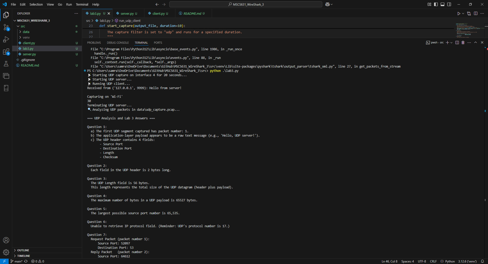

# MSCS631_WireShark_3
Wireshark Lab 3 – UDP

**Samrat Baral**

Wireshark – Lab 3: UDP

University of the Cumberlands  
2025 Spring – Advanced Computer Networks (MSCS-631-M40) – Full Term  
Dr. Yousef Nijim

February 16, 2025

---

## Lab Overview

In this lab, we capture and analyze UDP traffic generated from a custom UDP client/server exchange. Using tshark for packet capture and PyShark for analysis, we inspect the UDP header fields, payload sizes, and the request–response port relationships. The lab is focused on answering the following seven questions based on our UDP trace.

---

## Output Screenshots

  

## Features

- **Automatic Wi-Fi Interface Detection:**  
  The script automatically detects the Wi-Fi interface by searching for "Wi-Fi" or "Wireless" in the interface list from tshark.

- **UDP Packet Capture:**  
  Uses tshark with a capture filter (`-f "udp"`) to capture UDP packets for a specified duration and saves them to a PCAP file.

- **UDP Traffic Generation:**  
  Launches a UDP server and client to generate a simple exchange (e.g., a "Hello, UDP server!" message and a reply).

- **Packet Analysis:**  
  Analyzes the captured PCAP file with PyShark, extracting details such as:
  - The packet number of the first UDP segment.
  - The application-layer payload type.
  - The number and names of fields in the UDP header.
  - The length (in bytes) of each UDP header field.
  - Verification of the UDP Length field.
  - The maximum UDP payload size.
  - The largest possible source port.
  - The IP protocol number (with support for both IPv4 and IPv6).
  - A detailed analysis of a UDP request-response pair (with port swapping).

## Prerequisites

- **Python 3.x**
- **Tshark:** Ensure that Tshark is installed and available in your system's PATH.  
  Download from [Wireshark](https://www.wireshark.org/download.html).
- **Pyshark:** Install via pip:
  ```bash
  pip install pyshark
python lab3.py
```

>> 
📡 Starting UDP capture on interface 4 for 20 seconds...
📡 Starting UDP server...
📡 Running UDP client...
Received from ('127.0.0.1', 9999): Hello from server!
Terminating UDP server...
...
=== UDP Analysis and Lab 3 Answers ===
Question 1:
  a) The first UDP segment captured has packet number: 4.
  b) The application-layer payload appears to be a raw text message (e.g., 'Hello, UDP server!').
  c) The UDP header contains 4 fields: Source Port, Destination Port, Length, Checksum.
...


```

## Usage

To run the lab 3 , execute:

```bash
python lab3.py
```

## Lab Analysis and Answers to Questions

### 1. Select the first UDP segment in your trace. What is the packet number4 of this segment in the trace file? What type of application-layer payload or protocol message is being carried in this UDP segment? Look at the details of this packet in Wireshark. How many fields there are in the UDP header? (You shouldn’t look in the textbook! Answer these questions directly from what you observe in the packet trace.) What are the names of these fields? 
- **a)** **Packet Number:**  
  The first UDP segment captured has packet number: **1**.
- **b)** **Application-Layer Payload:**  
  The payload appears to be a raw text message (e.g., `"Hello, UDP server!"`).
- **c)** **UDP Header Fields:**  
  The UDP header contains **4 fields**:
  - Source Port
  - Destination Port
  - Length
  - Checksum

---

### 2. What is the length (in bytes) of each UDP header field?
- **Answer:**  
  Each field in the UDP header is **2 bytes** long.

---

### 3. The value in the Length field is the length of what? (You can consult the text for this answer). Verify your claim with your captured UDP packet.
- **Answer:**  
  The UDP Length field is **56 bytes**.  
  This value represents the total size of the UDP datagram (header plus payload).

---

### 4. What is the maximum number of bytes that can be included in a UDP payload?
- **Answer:**  
  The maximum number of bytes in a UDP payload is **65,527 bytes**.  
  *(This is derived from the maximum UDP datagram size of 65,535 bytes minus the 8-byte header.)*

---

### 5. What is the largest possible source port number? (Hint: see the hint in 4.)
- **Answer:**  
  The largest possible source port number is **65,535**.

---

### 6. What is the protocol number for UDP? Give your answer in decimal notation. To answer this question, you’ll need to look into the Protocol field of the IP datagram containing this UDP segment (see Figure 4.13 in the text, and the discussion of IP header fields).

- **Answer:**  
  The protocol number for UDP is **17**.

---

### 7. EExamine the pair of UDP packets in which your host sends the first UDP packet and the second UDP packet is a reply to this first UDP packet. (Hint: for a second packet to be sent in response to a first packet, the sender of the first packet should be the destination of the second packet). What is the packet number5 of the first of these two UDP segments in the trace file? What is the value in the source port field in this UDP segment? What is the value in the destination port field in this UDP segment? What is the packet number6 of the second of these two UDP segments in the trace file? What is the value in the source port field in this second UDP segment? What is the value in the destination port field in this second UDP segment? Describe the relationship between the port numbers in the two packets.

- **Request Packet (packet number 1):**
  - Source Port: **52097**
  - Destination Port: **53**
- **Reply Packet (packet number 2):**
  - Source Port: **64612**
  - Destination Port: **53**
- **Relationship:**  
  The reply packet typically swaps the source and destination ports from the request.

---

## Project Features

- **Automatic Wi-Fi Interface Detection:**  
  The integrated Python script automatically detects the Wi-Fi interface by scanning the list provided by tshark.
  
- **UDP Packet Capture:**  
  Tshark is used with the capture filter (`-f "udp"`) to capture UDP traffic for a specified duration, saving the packets to a PCAP file.
  
- **UDP Traffic Generation:**  
  A custom UDP server and client exchange a simple message (e.g., `"Hello, UDP server!"` and a corresponding reply), generating UDP traffic.
  
- **Packet Analysis:**  
  PyShark is employed to analyze the captured packets, extracting fields such as header lengths, total datagram size, maximum payload, and port information.

---

## Troubleshooting

- **No UDP Packets Found:**  
  Ensure the UDP server and client scripts are functioning and that the capture duration is long enough to capture the UDP traffic.

- **Interface Issues:**  
  Verify that your system's Wi-Fi interface is correctly detected. Adjust the interface detection logic if needed.

## Conclusion

This lab demonstrated the use of Wireshark for capturing and analyzing UDP traffic. By integrating tshark, PyShark, and custom UDP client/server scripts, we were able to inspect UDP header fields and payloads, verify protocol details, and analyze the request-response behavior of UDP communication.
